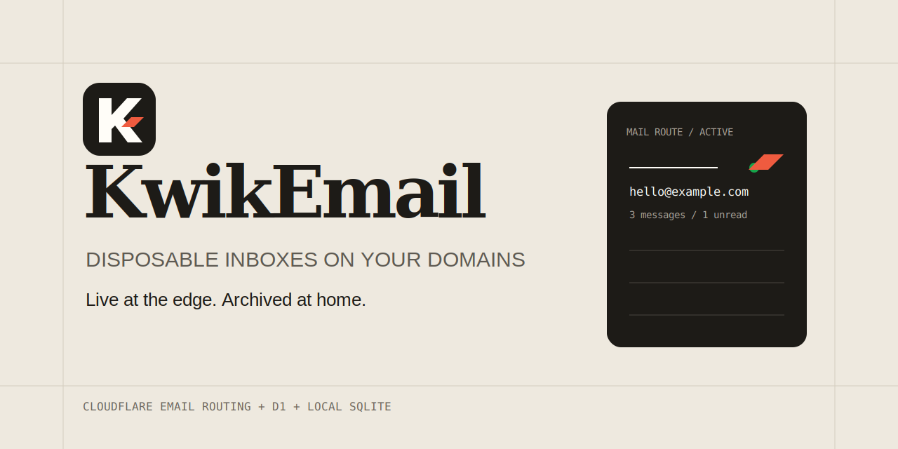
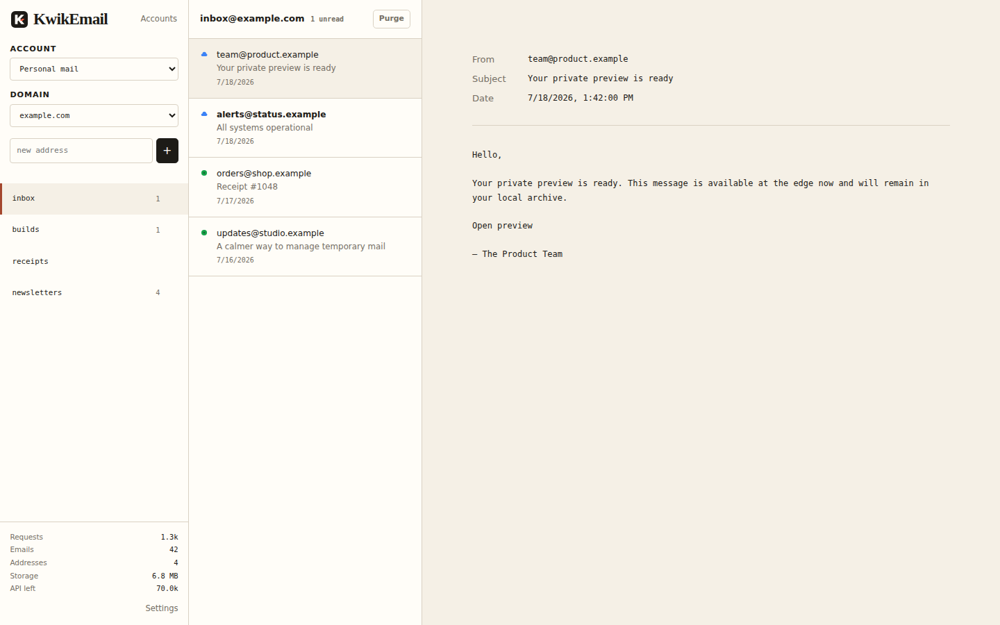

# KwikEmail

**Disposable inboxes on your domains. Live at the edge, archived at home.**

KwikEmail is a self-hosted disposable-email dashboard powered by Cloudflare Email Routing and D1, with an independent local SQLite archive. It deploys the cloud pieces from a browser setup flow and keeps credentials encrypted on your machine.



## Interface

The desktop dashboard keeps addresses, messages, and the selected email visible without nested navigation.



## Features

- Create disposable addresses on domains you control.
- Reject mail sent to unknown envelope recipients.
- Deploy one Worker and one D1 database per Cloudflare account from the browser.
- Share one deployment across multiple domains in the same account.
- Keep live mail in D1 for 24 hours and archive it independently at home.
- Manage multiple Cloudflare accounts and distinguish cloud-backed from local-only messages.
- Poll only the selected inbox every 10 seconds while the browser tab is visible.

## Requirements

- Docker Engine with Compose v2.
- A Cloudflare account and at least one Cloudflare-managed domain.
- Permission to manage Workers, D1, and Email Routing through an API token or Wrangler OAuth.
- Node 24 only when developing from source.

## Quick Start

```bash
install -d -m 700 data
docker compose up -d --build
```

Open `http://localhost:3005`, sign in with temporary password `123456`, and replace it immediately. Setup actions remain blocked until the password is changed.

The service binds to `127.0.0.1` by default. For private remote access, use `tailscale serve` or set `BIND_ADDRESS` to the machine's specific Tailscale IP. Do not use `0.0.0.0` unless a trusted firewall or authenticated HTTPS reverse proxy protects the service.

The browser setup wizard is the only production deployment path. It accepts a Cloudflare API token or Wrangler OAuth, discovers accessible accounts and domains, verifies Email Routing, and generates deployment-specific Wrangler configuration and secrets. Root `.env` credentials and the local `wrangler.toml` are not used for production deployment.

## Configuration

No `.env` file is required. Only `.env.example` belongs in source control. If needed, copy it to an ignored `.env` and change these optional Compose settings:

```env
BIND_ADDRESS=127.0.0.1
PORT=3005
```

Set `COOKIE_SECURE=true` in the container environment when the dashboard is always served through HTTPS.

## Architecture

```text
Internet mail
    |
Cloudflare Email Routing
    |
Worker ---- D1 live mail (24 hours)
    |
Authenticated Worker API
    |
Homelab dashboard ---- /data/kwikemail.sqlite (persistent archive)
```

- One Worker and D1 database are deployed per Cloudflare account.
- Enabled domains in that account route mail to the same Worker.
- The Worker owns addresses and rejects unknown recipients.
- An hourly Worker cron removes D1 mail older than 24 hours.
- The dashboard archives every ready account on startup and hourly.
- Cloud and local copies merge by account and message ID.

KwikEmail is a disposable-email appliance, not a durable primary mailbox. Cloudflare or homelab outages can create archival gaps.

## Persistence

Compose bind-mounts `./data` to `/data`. It contains:

- `kwikemail.sqlite`: settings, sessions, deployment metadata, and archived email.
- `kwikemail.key`: the key used to encrypt Cloudflare credentials and Worker bootstrap keys.
- `.wrangler`: local Wrangler OAuth profiles.

Possession of both the database and key permits credential decryption. Never commit, publish, or include `/data` in support bundles.

### Backup

Stop SQLite before copying its files:

```bash
docker compose down
tar -czf kwikemail-data-backup.tar.gz data/
docker compose up -d
```

Store the archive encrypted. To restore, stop the service, restore the complete directory, verify its ownership and permissions, then start the service.

## Updating

```bash
docker compose down
tar -czf kwikemail-data-backup.tar.gz data/
docker compose build --pull
docker compose up -d
```

Local schema migrations run during startup. Cloudflare deployment changes are managed separately from the Accounts panel.

## Removing a Deployment

Deleting an account from the Accounts panel removes its Email Routing references, Worker, D1 database, local addresses, archived mail, and unused credential. This is destructive and cannot be undone without a backup.

To remove the appliance after deleting its Cloudflare deployments:

```bash
docker compose down
```

Delete `data/` only when its archives and credentials are no longer needed.

## Development

The checked-in `packages/backend/wrangler.toml` is an intentionally non-production local configuration. Use an ignored `packages/backend/.dev.vars` with a development-only `API_KEY` when exercising authenticated Worker routes locally.

```bash
cd packages/backend
npm ci
npm test
npm run typecheck
npm run db:migrate:local
npx wrangler deploy --dry-run

cd ../frontend
npm test
npm start

cd ../..
docker compose config --quiet
docker compose build
```

Backend migrations live in `packages/backend/migrations`; migration failures stop deployment.

## Troubleshooting

- First login rejected: use `123456` only while setup is incomplete; configured installations use the password chosen during setup.
- Dashboard unreachable remotely: keep loopback for local use or bind to the machine's Tailscale IP.
- OAuth failed at localhost: paste the complete failed callback URL into the setup wizard.
- Deployment failed: verify the credential can manage Workers, D1, and Email Routing for every selected zone.
- Restore cannot decrypt credentials: restore the matching `kwikemail.key` together with the database.

Do not post unsanitized logs, callback URLs, account IDs, domains, tokens, or email content in public issues.

## Security

Read [SECURITY.md](SECURITY.md) before exposing or backing up the service. Security reports must use GitHub private vulnerability reporting rather than public issues.

## Contributing

See [CONTRIBUTING.md](CONTRIBUTING.md). Every behavior change requires a test.

## License

Licensed under the [GNU Affero General Public License v3.0 only](LICENSE). If you run a modified version over a network, the AGPL requires you to offer its corresponding source to users of that service.
